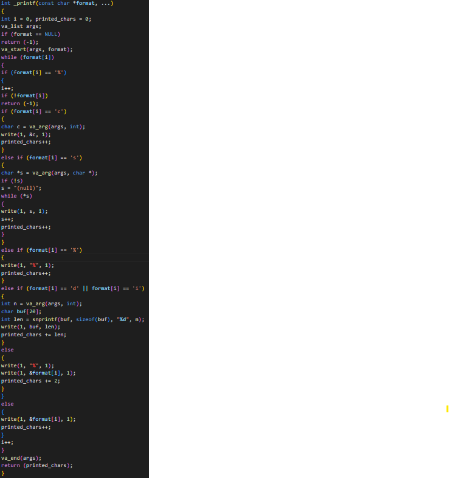
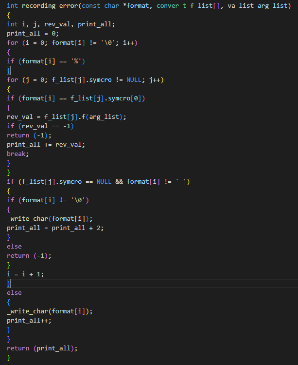
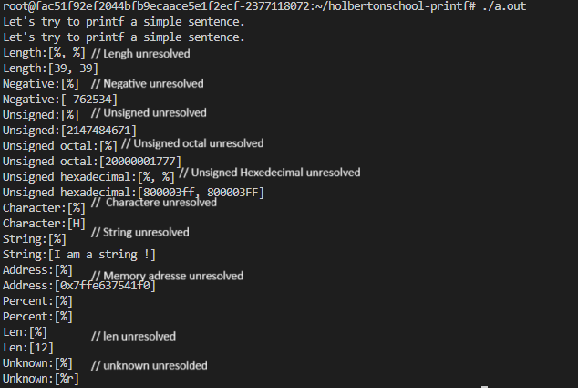
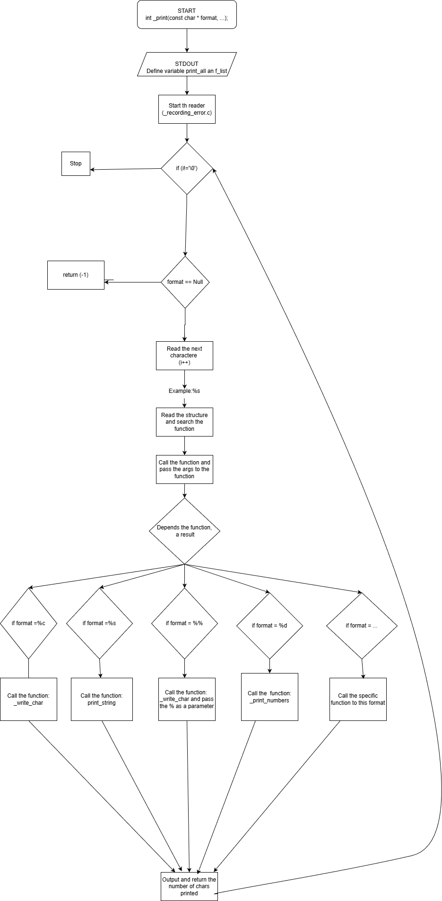

# Holbertonschool : Printf by Tommy JOUHANS and Maxence HENOUS

This repository contains the data for the team project by Tommy Jouhans and Maxence Henous at Holberton School in Dijon concerning the `printf` function.

The `printf()` function displays the result on standard output (stdout), based on the format and other arguments passed to it.

_printf.c:
The format consists of two types of elements: the characters to be displayed on the screen,
The prototype of this function is: int _printf(const char format, ...);
This project is a very simple explanation of how the _printf function works:
We check if the text to be displayed (format) is empty.

_recording_error.c:
If so, we stop everything and return -1
We prepare the list of functions that can display each data type (%d, %s, %c, etc.).
We retrieve the arguments that the user provided after the format (using va_list).
We call a function (recording_error) that reads the format, finds the correct % symbols, and uses the appropriate function to display each value.
We exit cleanly and return the total number of characters displayed.

# **Compilation:**

When you are done creating you *main.c* file  you will need to compile it. You can use any compiler software you like, although this project was tested in gcc (Ubuntu 11.4.0-1ubuntu1~22.04.2) 11.4.0 with different error flags such as:

root@fac51f92ef2044bfb9ecaace5e1f2ecf-2377118072:~/holbertonschool-printf# gcc -Wall -Wextra -Werror -pedantic -Wno-format *.c

# ** MAN_PAGE **

LANG=C man ./printf | col -b > docs/print.man.txt

# **Execution:**
For a week we tried to solve the advanced tasks; it was obvious, we tried to display a small part of the... All the above options work well together. We were unable to solve the following functions to handle the following conversion specifiers:
u, o, x, X, S, +, space, l, h, r, R and to use a local buffer of 1024 characters in order to call write as little as possible. The field width and precision for non-custom conversion specifiers, the 0 flag character for non-custom conversion specifiers, the - flag character.

For compiled program:

For checking with valgrind:

## **Flowchart**

The flowchart provides a structured illustration of the function's internal workings in C, showing how it begins by sending data to standard output (STDOUT), then prints each normal character of the string passed as an argument while counting the number of characters printed. When a symbol is encountered, it enters conditional logic that identifies the type of specifier (for integers, characters, strings, or the symbol itself), processes the corresponding value, prints it correctly, increments the counter, and finally returns the total number of characters printed. This allows the function to provide accurate feedback on the print operation performed.

## **Authors**
Tommy JOUHANS (https://github.com/TommyJOUHANSC28)
Maxence HENOUS

