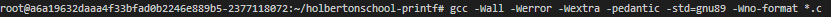
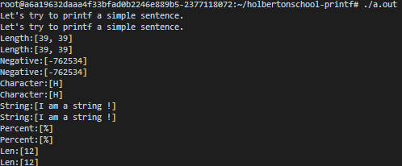
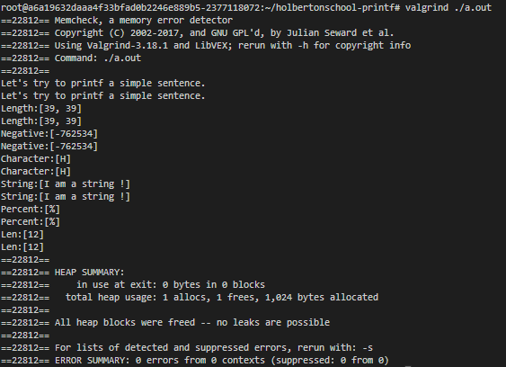
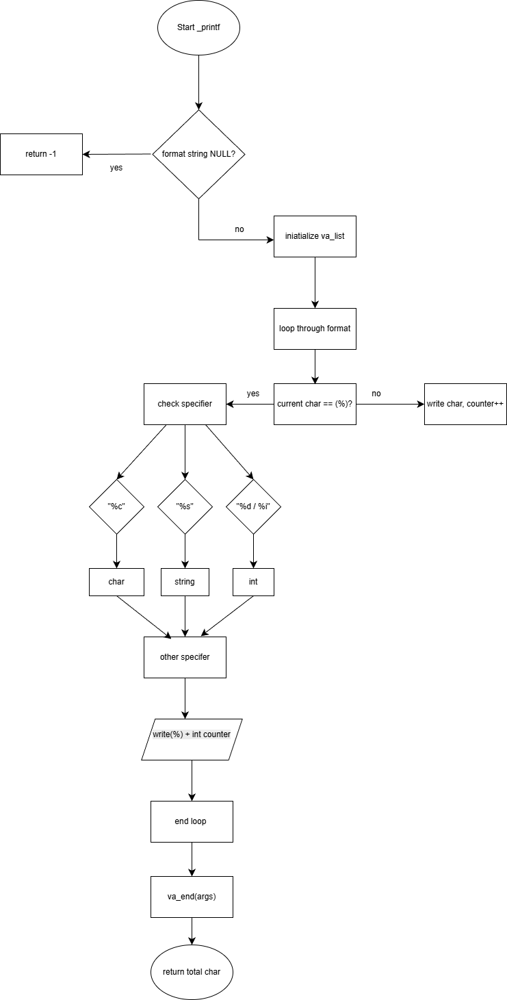

# Holbertonschool : Printf by Tommy JOUHANS and Maxence HENOUS

This repository contains the data for the team project by Tommy Jouhans and Maxence Henous at Holberton School in Dijon concerning the `printf` function.

The `printf()` function displays the result on standard output (stdout), based on the format and other arguments passed to it.

_printf.c:

The format consists of two types of elements: the characters to be displayed on the screen,
The prototype of this function is: int _printf(const char format, ...);
This project is a very simple explanation of how the _printf function works:
We check if the text to be displayed (format) is empty.
If so, we stop everything and return -1.
We prepare the list of functions that can display each data type (%d, %s, %c, etc.).
We exit cleanly and return the total number of characters displayed.

# **Compilation:**

When we are done creating our *main.c* file  we will need to compile it. We can use any compiler software you like, although this project was tested in gcc (Ubuntu 11.4.0-1ubuntu1~22.04.2) 11.4.0 with different error flags such as:

# ** MAN_PAGE **

Hyperlinks from our printf man page:

# **Execution:**

For compiled program:

For checking with  "Valgrind" to test if it has a memory leak:

## **Flowchart**

## **Authors**
Tommy JOUHANS (https://github.com/TommyJOUHANSC28)
Maxence HENOUS (https://github.com/maxence30)

